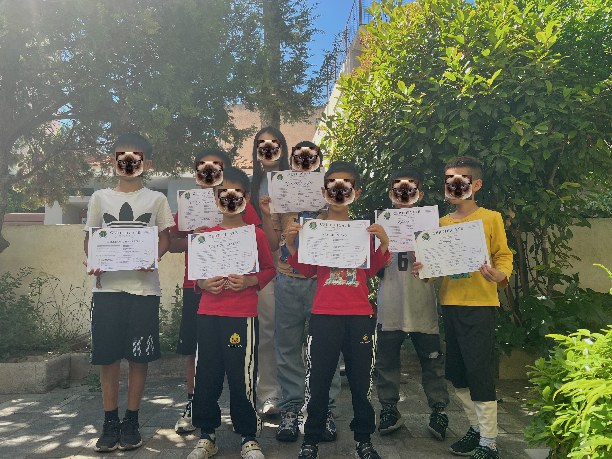

## 课程简介（Overview）：
A Scratch tutorial courseware aimed at building computational thinking for kids aged 7-10 using visual coding blocks.

## 课程大纲（Syllabus）：
### Lesson 1: ...
### Lesson 2: ...

## 教学成果（Impact）：
提到这套课件已在社区/课堂中实际交付给多少名学生使用。

## 现场图片/项目截图：
在 README 中嵌入几张课件运行效果图，或者现场教学的相片（注意给孩子脸部打码或选择背影）。

